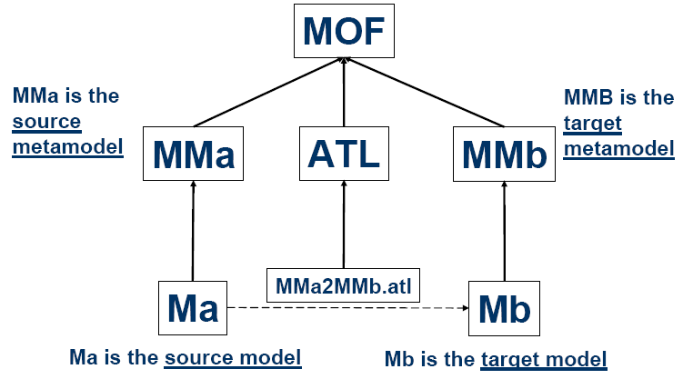

# ATL overview (in pictures)

## Model-to-Model Transformations in Model-Driven Engineering
[by Frederic Jouault]

 

## ATL operational context 
[from https://en.wikipedia.org/wiki/ATLAS_Transformation_Language]

 

## Example 
[by Frederic Jouault]

 
