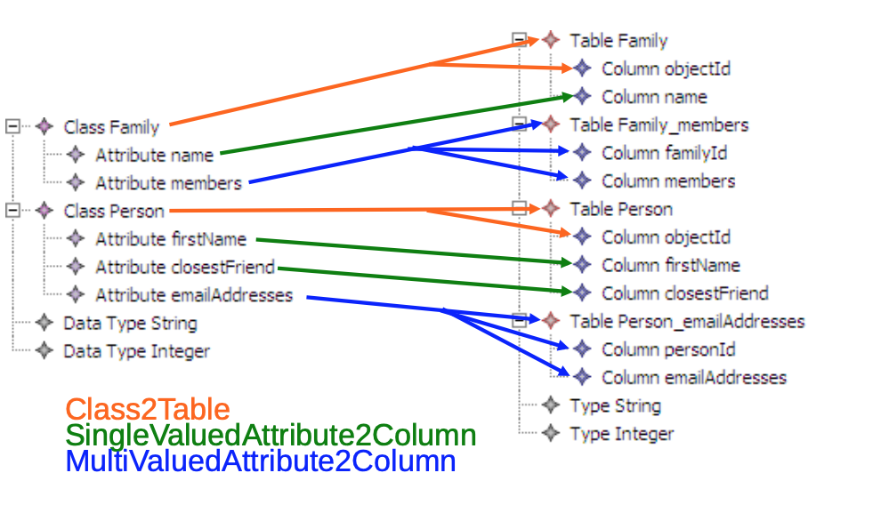

# Class2Relational transformation in ATL

## Informal description of rules

Class2Table: 

  * A table is created from each class,
  * The columns of the table correspond to the single-valued attributes of the class,
  * A column corresponding to the key of the table is created. 
  
SingleValuedAttribute2Column:

  * A column is created from each single-valued attribute. 

MultiValuedAttribute2Column:

  * A table with two columns is created from each multi-valued attribute,
  * One column refers to the key of the table created from the owner class of the attribute,
  * The second column contains the value of the attribute.

## Example of transformation

 